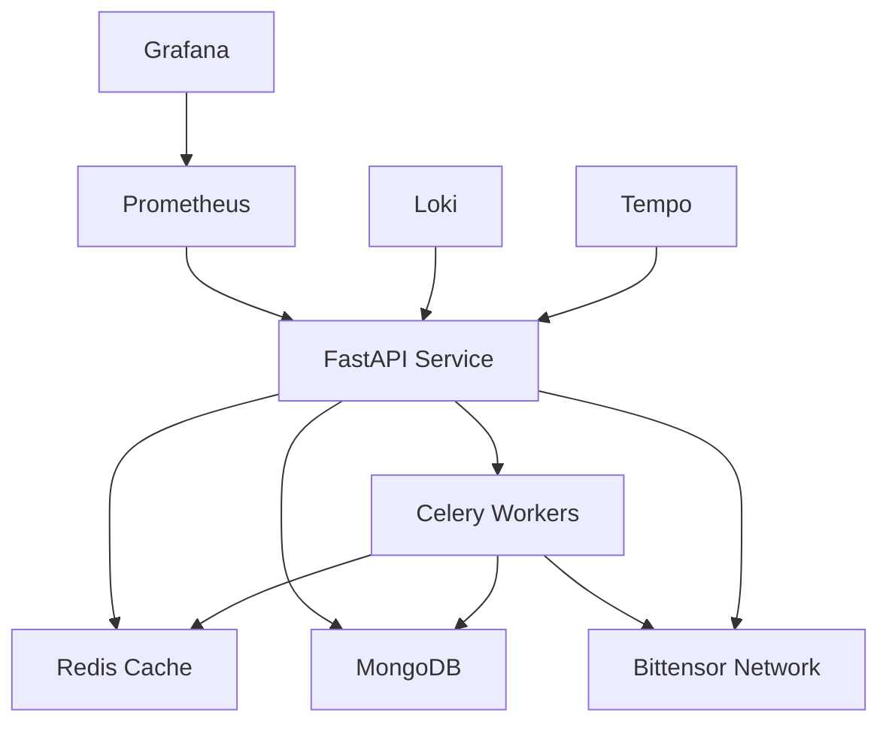

# Tao Dividends API

A production-grade, asynchronous FastAPI service for querying Tao dividends from the Bittensor blockchain, with Redis caching, MongoDB persistence, and background sentiment-based staking/unstaking via Celery. 

## Features
- **Async FastAPI endpoint** to query Tao dividends for a subnet/hotkey
- **Redis caching** (2 min TTL) for blockchain queries
- **Celery background tasks** for Twitter sentiment analysis and stake/unstake
- **MongoDB** for persistent storage
- **Authentication** via API key (header: `X-API-Key`)
- **Dockerized** for easy local or cloud deployment
- **Prometheus & Grafana** for monitoring
- **OpenTelemetry** for distributed tracing
- **Loki** for log aggregation
- **Comprehensive tests** with pytest (including concurrency)

## Architecture Overview



## Quick Start

### 1. Clone & Configure
```bash
git clone https://github.com/timothywangdev/tao-staking
cd tao-staking
cp .env.example .env  # Edit with your secrets
```

### 2. Install Dependencies
We use `uv` for fast, reliable Python package management:

```bash
# Install uv if not already installed
pip install uv

# Install production dependencies
uv pip install -r pyproject.toml

# Install development dependencies
uv pip install -r pyproject.toml --extra dev
```

### 3. Run with Docker Compose
```bash
docker compose up --build
```

Services available:
- FastAPI: [http://localhost:8000/docs](http://localhost:8000/docs)
- Flower (Celery monitor): [http://localhost:5555](http://localhost:5555)
- Grafana: [http://localhost:3000](http://localhost:3000)
- Prometheus: [http://localhost:9090](http://localhost:9090)
- Loki: [http://localhost:3100](http://localhost:3100)
- Tempo: [http://localhost:4317](http://localhost:4317)
- MongoDB: localhost:27017
- Redis: localhost:6379

## Environment Setup

### Required Environment Variables
Create a `.env` file in the project root:

```bash
# Core Settings
SECRET_KEY=                     # Required: API key for authentication, min 32 chars
DEBUG=false                     # Optional: Enable debug mode (default: false)

# Bittensor Settings
BITTENSOR_NETWORK=test         # Required: 'test' or 'main'
BITTENSOR_WALLET_MNEMONIC=""   # Required: Your wallet's mnemonic phrase
BITTENSOR_WALLET_PATH=         # Optional: Custom wallet path
BITTENSOR_WALLET_NAME=         # Optional: Custom wallet name
DEFAULT_HOTKEY=5FFApaS75bv5pJHfAp2FVLBj9ZaXuFDjEypsaBNc1wCfe52v  # Optional
DEFAULT_NETUID=18              # Optional: Default subnet ID

# External API Keys
DATURA_API_KEY=                 # Required: Get from https://docs.datura.ai/
CHUTES_API_KEY=                 # Required: Get from https://chutes.ai/

# Infrastructure Settings
MONGODB_URL=mongodb://db:27017          # Required: MongoDB connection URL
MONGODB_DB_NAME=tao_dividends           # Required: Database name
REDIS_URL=redis://cache:6379/1          # Required: Redis connection URL
REDIS_POOL_SIZE=100                     # Optional: Connection pool size (default: 100)
REDIS_CACHE_TTL=120                     # Optional: Cache TTL in seconds (default: 120)

# Rate Limiting
RATE_LIMIT_PER_MINUTE=60               # Optional: Requests per minute (default: 60)
RATE_LIMIT_BURST=100                   # Optional: Burst limit (default: 100)
RATE_LIMIT_STORAGE_URL=redis://cache:6379/0  # Optional: Rate limit storage

# Observability
OTLP_GRPC_ENDPOINT=http://tempo:4317   # Required for tracing
LOKI_URL=http://loki:3100/loki/api/v1/push  # Required for logging
```

### Environment Variable Validation Rules

1. **Core Settings**
   - `SECRET_KEY`: Must be at least 32 characters long
   - `DEBUG`: Boolean value (true/false)

2. **Bittensor Settings**
   - `BITTENSOR_NETWORK`: Must be either 'test' or 'main'
   - `BITTENSOR_WALLET_MNEMONIC`: Must be a valid BIP-39 mnemonic phrase
   - `DEFAULT_HOTKEY`: Must be a valid SS58 address
   - `DEFAULT_NETUID`: Must be a positive integer

3. **External APIs**
   - `DATURA_API_KEY`: Must be a valid API key
   - `CHUTES_API_KEY`: Must be a valid API key

4. **Infrastructure**
   - `MONGODB_URL`: Must start with 'mongodb://' or 'mongodb+srv://'
   - `REDIS_URL`: Must start with 'redis://'
   - All connection URLs must be valid URIs

5. **Rate Limiting**
   - All numeric values must be positive integers
   - Burst limit must be greater than per-minute limit

### Docker vs Local Development

For **Docker** development:
```bash
# Infrastructure services should use Docker service names
MONGODB_URL=mongodb://db:27017
REDIS_URL=redis://cache:6379/1
OTLP_GRPC_ENDPOINT=http://tempo:4317
LOKI_URL=http://loki:3100/loki/api/v1/push
```

For **local** development:
```bash
# Infrastructure services should use localhost
MONGODB_URL=mongodb://localhost:27017
REDIS_URL=redis://localhost:6379/1
OTLP_GRPC_ENDPOINT=http://localhost:4317
LOKI_URL=http://localhost:3100/loki/api/v1/push
```

### Quick Setup

1. Copy the example file:
   ```bash
   cp .env.example .env
   ```

2. Update the `.env` file with your values using your preferred editor:
   ```bash
   code .env  # or use any text editor
   ```

### Troubleshooting Environment Issues

1. **MongoDB Connection Issues**
   - Ensure MongoDB is running: `docker compose ps`
   - Check logs: `docker compose logs db`
   - Verify URL format and credentials

2. **Redis Connection Issues**
   - Ensure Redis is running: `docker compose ps`
   - Test connection: `redis-cli -h localhost ping`
   - Check for correct port mapping

3. **API Key Issues**
   - Verify key format and validity
   - Check for proper environment loading
   - Ensure no whitespace in values

4. **Wallet Issues**
   - Verify mnemonic phrase format
   - Check network selection
   - Ensure proper wallet initialization

## API Documentation

### GET `/api/v1/tao_dividends`
Query Tao dividends for a subnet/hotkey. Requires `X-API-Key` header.

**Query Parameters:**
- `netuid` (int, optional): Subnet ID (default: 18)
- `hotkey` (str, optional): Account hotkey (default: see config)
- `trade` (bool, optional): If true, triggers background sentiment-based stake/unstake (default: false)

**Example:**
```bash
curl -X GET "http://localhost:8000/api/v1/tao_dividends?netuid=18&hotkey=5FFApaS75bv5pJHfAp2FVLBj9ZaXuFDjEypsaBNc1wCfe52v" \
     -H "X-API-Key: your_api_key_here"
```

**Response:**
```json
{
  "netuid": 18,
  "hotkey": "5FFApaS75bv5pJHfAp2FVLBj9ZaXuFDjEypsaBNc1wCfe52v",
  "dividend": 123456789.0,
  "cached": true,
  "stake_tx_triggered": false
}
```

## Development

### Code Quality
```bash
# Format code
uvx ruff format
```

### Testing
```bash
# Run all tests
PYTHONPATH=. pytest tests/ --maxfail=3 --disable-warnings

# Run with coverage
pytest --cov=app --cov-report=term-missing
```

## Observability Stack

### Metrics (Prometheus)
- Request latency histograms
- Request/response counters by endpoint

### Logging (Loki)
- Structured JSON logging
- Log correlation with traces
- Log aggregation across services
- Custom log parsers for error detection

### Tracing (Tempo)
- Distributed request tracing
- Service dependency mapping
- Performance bottleneck analysis
- Error root cause analysis

### Dashboards (Grafana)
- API performance metrics
- Error rate monitoring
- System resource utilization

Access the monitoring stack:
1. Grafana: [http://localhost:3000](http://localhost:3000)
   - Default credentials: admin/admin
   - Pre-configured dashboards for API, Celery, and system metrics
2. Prometheus: [http://localhost:9090](http://localhost:9090)
   - Raw metrics and PromQL interface
3. Tempo: [http://localhost:4317](http://localhost:4317)
   - Trace visualization and analysis
4. Loki: [http://localhost:3100](http://localhost:3100)
   - Log querying and aggregation

## Design Decisions & Trade-offs

### Architecture Choices

#### FastAPI over Flask/Django
- **Pros**:
  - Native async/await support for high concurrency
  - Automatic OpenAPI documentation
  - Type checking with Pydantic
  - Better performance for async workloads
- **Trade-offs**:
  - Fewer built-in features (auth, admin, etc.)
  - Requires more manual setup for common patterns

#### MongoDB over PostgreSQL
- **Pros**:
  - Flexible schema for rapid iteration
  - Native async driver (Motor)
  - Better handling of JSON-like data
  - Easier horizontal scaling
- **Trade-offs**:
  - No ACID transactions (in most cases)
  - Less suitable for complex joins
  - Higher memory usage
  - Eventually consistent by default

#### Redis + Celery Stack
- **Pros**:
  - Redis as both cache and message broker
  - Celery's robust task scheduling
  - Easy scaling of workers
  - Built-in monitoring (Flower)
- **Trade-offs**:
  - Additional infrastructure complexity
  - Memory-bound scaling
  - Potential message loss on crashes
  - Requires careful memory management

### Implementation Decisions

#### Caching Strategy
- **Current Approach**:
  - 2-minute TTL for blockchain queries
  - Cache invalidation on stake/unstake
  - Redis as primary cache
- **Trade-offs**:
  - Short TTL sacrifices cache hit rate for data freshness
  - No cache warming (could add for popular hotkeys)
  - Single Redis instance (could add Redis Cluster)
  - No circuit breaker implementation yet

#### Background Processing
- **Current Approach**:
  - Sentiment analysis in background tasks
  - Results stored in Redis temporarily
  - Task status persisted in MongoDB
- **Trade-offs**:
  - No real-time sentiment updates
  - Potential task queue bottlenecks
  - Simple retry mechanism (could be more sophisticated)
  - No dead letter queue implementation yet

#### API Design
- **Current Approach**:
  - Single endpoint with query parameters
  - Optional background processing flag
  - Cached responses when possible
- **Trade-offs**:
  - Simpler API but less flexible
  - No batch processing endpoint
  - No streaming responses
  - Limited pagination support

### Security Considerations

#### Authentication
- **Current Approach**:
  - Simple API key authentication
  - Keys stored as environment variables
- **Trade-offs**:
  - Easy to implement and use
  - No granular permissions
  - No key rotation mechanism
  - Limited audit capabilities

#### Rate Limiting
- **Current Status**: Not implemented yet
- **Planned Approach**:
  - Per-client rate limiting
  - Redis-based token bucket algorithm
  - Configurable limits via environment
- **Future Considerations**:
  - IP-based rate limiting
  - Different limits for authenticated users
  - Rate limit by endpoint

### Observability Stack

#### Current Implementation
- Prometheus for metrics
- Loki for logs
- Tempo for traces
- Grafana for visualization

#### Limitations & Future Improvements
- No alerting configuration
- Basic dashboard setup
- Limited custom metrics
- No automated anomaly detection

### Known Limitations

1. **Scalability**
   - Single Redis instance bottleneck
   - No horizontal scaling configuration
   - Basic MongoDB setup without sharding
   - Limited concurrent task processing

2. **Reliability**
   - No circuit breaker pattern
   - Basic error handling
   - No fallback mechanisms
   - Limited retry strategies

3. **Monitoring**
   - Basic metrics collection
   - No automated alerts
   - Limited business metrics
   - No SLO/SLA monitoring

### Future Improvements

1. **High Priority**
   - Implement rate limiting
   - Add circuit breaker pattern
   - Improve error handling
   - Add key rotation mechanism

2. **Medium Priority**
   - Add batch processing endpoint
   - Implement cache warming
   - Add dead letter queue
   - Improve monitoring coverage

3. **Nice to Have**
   - Streaming response support
   - Advanced rate limiting
   - Automated alerts
   - Performance optimizations

## License
MIT